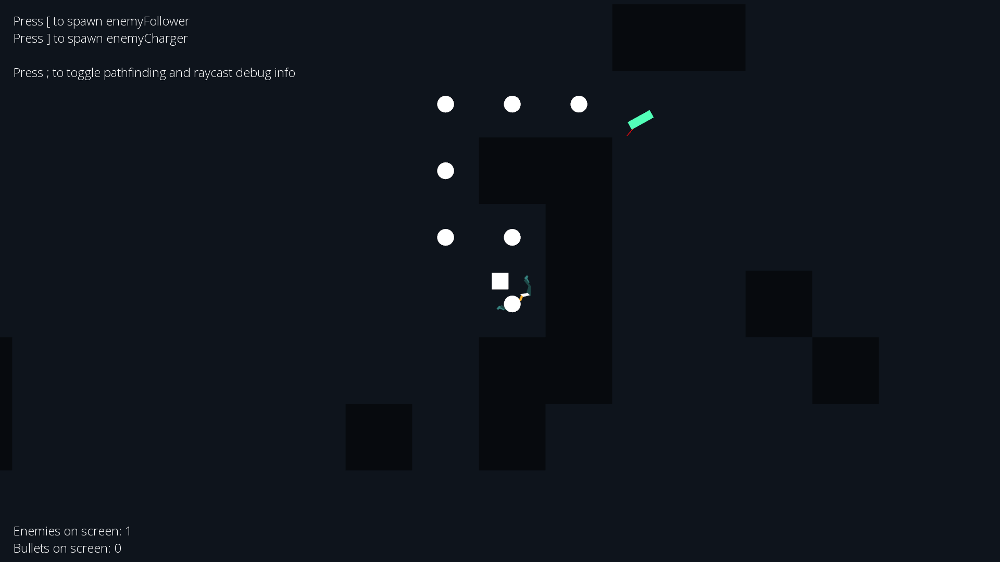

# Object-Oriented Programming Coursework
Welcome to my first-year coursework in Object-Oriented Programming (OOP) using C++ and SFML 2.5.1.

# Description
This coursework focuses on applying OOP principles in a C++ project. The main goal is to develop a game that demonstrates various aspects of OOP.  
  
Tasks assigned by the lecturer:
1. Implement and use constructors, destructors, operator overloading, and inheritance in different or the same classes based on their purpose
2. Create a graphical user interface (console or other)
3. Implement an intelligent computer opponent for the game
4. Ensure uniqueness of the program, clear and understandable solution, no code duplication, encapsulation maintained, proper destruction of dynamic memory objects (objects, arrays, etc.) in the destructor of controlling classes or when necessary
5. Design the program to be easily modifiable
6. Implement unique operations (additional bonuses) in the game that differentiate it from the classic version
7. Provide accurate responses to the lecturer's questions during the defense, ability to independently edit the code if requested
  
Enemies:  
* **EnemyFollower** Tracks and follows the player by utilizing the breadth-first search (BFS) algorithm. Additionally, it checks for a direct line of sight with the player by casting a ray. If a direct line of sight is possible, the EnemyFollower moves directly towards the player without the need for computationally expensive path-finding calculations.
* **EnemyCharger** Operates similarly to the EnemyFollower, but with an added feature. When the enemy instance is at least ``n`` units in proximity to the player and there is a clear line of sight, it enters a charging mode. During this mode, the EnemyCharger focuses on the player for a duration of ``n`` seconds. Once the charging duration is complete, the EnemyCharger initiates a charge in the last known direction of the player, maintaining its own original direction. After the charge is complete, the cycle repeats.
  
This coursework received maximum possible grade. 

Note: If you are using debug draw, you may notice some flickering. This happens because the rays are not cast continuously, but rather at specific intervals to improve performance.

# Screenshots

